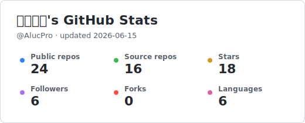

<h1 align="center">𝙷𝚒 𝚝𝚑𝚎𝚛𝚎 👋, 𝙸'𝚖 <a href="https://mingdg.notion.site/" target="_blank">𝙼𝚒𝚗𝚐</a></h1>
<h3 align="center">𝙵𝚞𝚕𝚕-𝚂𝚝𝚊𝚌𝚔 𝙴𝚗𝚐𝚒𝚗𝚎𝚎𝚛 𝚋𝚞𝚒𝚕𝚍𝚒𝚗𝚐 𝚝𝚘𝚘𝚕𝚜 𝚊𝚗𝚍 𝙰𝙸 𝚙𝚛𝚘𝚍𝚞𝚌𝚝𝚜.</h3>

  
  
  

---

### 👨‍💻 𝙰𝚋𝚘𝚞𝚝 𝙼𝚎

- 💼 𝙸'𝚖 𝚊 𝚙𝚊𝚜𝚜𝚒𝚘𝚗𝚊𝚝𝚎 𝚍𝚎𝚟𝚎𝚕𝚘𝚙𝚎𝚛 𝚠𝚑𝚘 𝚕𝚘𝚟𝚎𝚜 𝚋𝚞𝚒𝚕𝚍𝚒𝚗𝚐 𝚒𝚗𝚝𝚎𝚛𝚊𝚌𝚝𝚒𝚟𝚎 𝚎𝚡𝚙𝚎𝚛𝚒𝚎𝚗𝚌𝚎𝚜.
- 🧠 𝙲𝚞𝚛𝚛𝚎𝚗𝚝𝚕𝚢 𝚠𝚘𝚛𝚔𝚒𝚗𝚐 𝚘𝚗 𝚊𝚗 **𝙰𝙸-𝚙𝚘𝚠𝚎𝚛𝚎𝚍 𝚐𝚊𝚖𝚎** — [𝚁𝚘𝚕𝚕𝚒𝚗𝚐 𝚂𝚊𝚐𝚊𝚜](https://rollingsagas.com)
- 🌐 𝙸 𝚠𝚛𝚒𝚝𝚎 𝚊𝚋𝚘𝚞𝚝 𝚝𝚎𝚌𝚑, 𝚐𝚊𝚖𝚎𝚜, 𝚊𝚗𝚍 𝚕𝚒𝚏𝚎 𝚘𝚗 𝚖𝚢 [𝙱𝚕𝚘𝚐](https://dg.aluc.me/)
- 📫 𝚁𝚎𝚊𝚌𝚑 𝚘𝚞𝚝 𝚝𝚘 𝚖𝚎 𝚟𝚒𝚊 [𝙻𝚒𝚗𝚔𝚎𝚍𝙸𝚗](https://www.linkedin.com/in/%E5%BE%90%E6%98%8E-%E9%87%91-b54815259/)

---

### 📊 𝙶𝚒𝚝𝙷𝚞𝚋 𝚂𝚝𝚊𝚝𝚜

  

---

### 🌐 𝙲𝚘𝚗𝚗𝚎𝚌𝚝 𝚠𝚒𝚝𝚑 𝙼𝚎

  
  
  
  
  

---

### 🚀 𝙿𝚛𝚘𝚓𝚎𝚌𝚝𝚜

<!-- PROJECTS:START -->
| Project | Homepage | Stars | Forks | Downloads | Version | Description |
| --- | --- | ---: | ---: | ---: | --- | --- |
| [tool-manage](https://github.com/AlucPro/tool-manage) | [Website](https://www.npmjs.com/package/@alucpro/tool-manage) | 2 | 0 | 1.3k total | `0.2.3` | Manage local AI tool plugins and skills from the terminal. |
| [pom-tool](https://github.com/AlucPro/pom-tool) | [Website](https://github.com/AlucPro/pom-tool) | 2 | 0 | 526 total | `0.3.1` | A simple Pomodoro timer CLI for terminal focus sessions. |
| [Logseq LeetCode](https://github.com/AlucPro/logseq-plugin-leetcode) | - | 9 | 0 | 699 total | - | A Logseq plugin that batch fetches LeetCode problems. |
| [LexiNote](https://github.com/AlucPro/obsidian-lexinote) | [Website](https://dg.aluc.me/Projects/OBSIDIAN-LEXINOTE) | 3 | 0 | 51 total | - | An Obsidian plugin for LexiNote. |
<!-- PROJECTS:END -->
